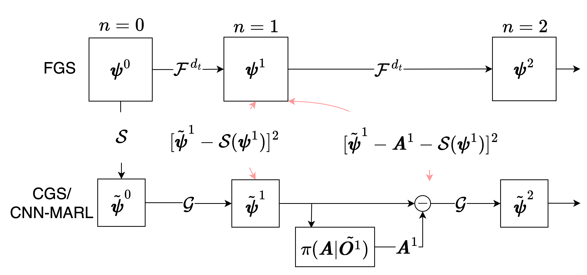
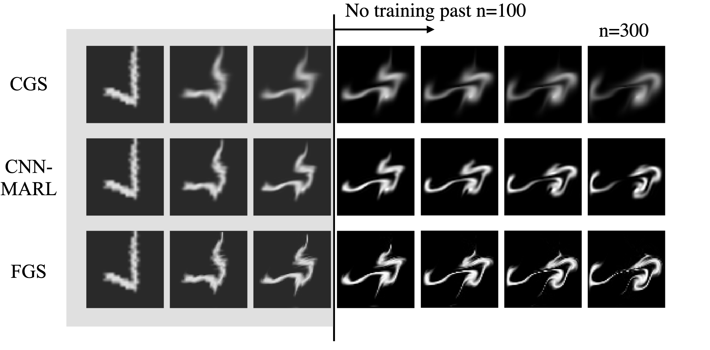

# Closure Discovery for Coarse Grained Partial Differential Equations using Multi-Agent Reinforcement Learning

## Description
This is the official PyTorch/tianshou implementation of the paper *Closure Discovery for Coarse Grained Partial Differential Equations using Multi-Agent Reinforcement Learning*.

<p align="center">
    
</p>
<p align="center">
    
</p>

This repository allows to train a multi-agent reinforcement learning (MARL) agents to discover a closure model for a multiscale system. 
As a result, the agents are able to improve the accuracy of a coarse-grained simulation (CGS) significantly. 
A qualitative example of the improvement is shown in the figure below. The CGS combined with the agents is referred to as CNN-MARL.

<div align="center">
    <table style="width: 100%;">
      <tr>
        <td style="width: 33%; text-align: center;">
          <p>CGS (Baseline)</p>
          
        </td>
        <td style="width: 33%; text-align: center;">
          <p>CNN-MARL</p>
          
        </td>
        <td style="width: 33%; text-align: center;">
          <p>FGS (Ground Truth)</p>
          
        </td>
      </tr>
    </table>
</div>


## Getting Started
### Model Training
Run the `rl_train.py` script to train a model. The script takes arguments to specify the model, environment, data, and training parameters. 

For example to train a PPO agent for the advection equation with initial conditions from the MNIST dataset, run:
```
python rl_train.py --algo ppo --env advection --dataset mnist --vel_type train
```

If non-existent, the script will create the folder `weights/policy_dump` where the trained and intermediate models will be saved. 
The logging is done with `wandb`, so you will be prompted to login or create an account, when running the script.

### Arguments
The following arguments can be passed to the `rl_train.py` script:
- `--env`: Environment to train on. Choose from `advection` or `burgers`
- `--dataset`: Dataset to train on. Choose from `mnist` or `fashion` for FashionMNIST
- `--vel_type`: Velocity type to train on. Choose from `train` corresponds to the $\mathcal D_{Train}^{Vortex}$ used for the advection example and `train2` corresponds to the adapted version used for the Burgers example. `vortex` corresponds to the $\mathcal D_{Test}^{Vortex}$ distribution used for the out-of-distribution evaluations for the advection example. 
- `--img_size`: Image size of the dataset for the CGS. Images are automatically resized upon loading. `img_size` thereby corresponds to the number of discretization points of the CGS.
- `--subsmaple`: Subsamling factor used to map from FGS to CGS. `img_size` * `subsample` corresponds to the number of discretization points of the FGS.
- `--ep_len`: Minimum number of CGS steps of an episode.
- `--algo`: Algorithm to train. Choose from `ppo` or `a2c`.

### Model Weights
The weights of the trained models used to obtain the results of the paper are provided in the `weights/policy_launch_platform` folder.

For advection:
> mnist_train_ppo_IRCNN_eplen:4_seed:0_subsample:4_discount:0.95_growing_ep_len_maxed

For Burgers:
> burgers_train2_ppo_IRCNN_eplen:20_seed:0_subsample:5_discount:0.95_num_cgs_points:30_ent_coef:0.05_adaptivelen_200max

## Evaluation
The jupyter notebooks 
- `action_interpretation.ipynb`
- `advection_evaluation.ipynb`
- `burgers_evaluation.ipynb` 

contain the code to reproduce the results from the paper.

As running multiple simulations for the evaluations takes long, we provide the option to load the simulation data for the results from this [Google Drive link](https://drive.google.com/file/d/1Kz0AIpIizymvtfP5xXUMtzvg-S2Cl-Wl/view?usp=sharing). Unzip the folder and move it to `results/` for further analysis with the notebooks.

## Acknowledgements
Inspiration, code snippets from:
- [cszn/KARI: Image Restoration Toolbox](https://github.com/cszn/KAIR)